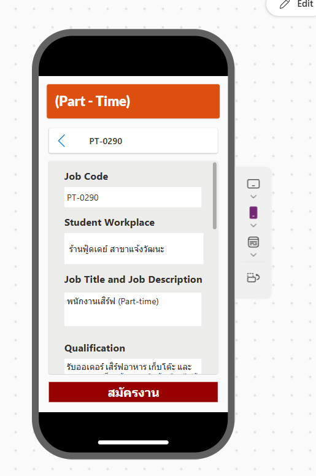

# 🚀 Student Work Management System

> 🚧 **Status: Work In Progress (Under Development)**
> *This project is currently in the development phase. Features, UI, and backend automation flows are actively being built and refined.*

An automated end-to-end workflow, mobile application, and data pipeline designed to efficiently manage student work assignments (Part-Time & Full-Time) using the Microsoft Power Platform ecosystem and Google Workspace integration.

---

## 🛠️ Tech Stack & Architecture
* **Frontend UI:** Microsoft Power Apps (Mobile Layout)
* **Workflow & Automation:** Microsoft Power Automate (Cloud Flows)
* **Database & Storage:** Microsoft SharePoint Lists (Mock datasets provided as `.csv`)
* **Backend Integration:** Google Apps Script (`.gs`) & Google Forms/Sheets
* **Data Visualization:** Microsoft Power BI

---

## 📊 System Architecture & Workflow
Here is the high-level workflow and architecture designed for this system, illustrating the data flow from Google Forms to SharePoint and Power BI:

---

## 📱 Application Interface (Power Apps)
A preview of the mobile user interface designed for browsing jobs, viewing qualifications, and submitting applications:

---

## 🗄️ Database Schema & Mock Datasets (SharePoint Lists)
The system utilizes structured SharePoint lists to handle master data and application statuses. Sample datasets are included in this repository to demonstrate the data structure:
* `(Full Time).csv` & `(Part - Time).csv` - Job listings and details
* `Company Master.csv` - Enterprise and workplace partner data
* `ApplicationStatus.csv` - Real-time tracking of student job applications

---

## ⚙️ Power Automate Package Flows
Exported workflow packages (`.zip`) are included in this repository for deployment and logic reference:
* `CompanyMasterSync_20260825042229.zip` - Automated synchronization of company data
* `FLW_Job_Application_20260825042156.zip` - Streamlined job application processing flow
* `FLW_Student_Registration_20260825042104.zip` - Automated student registration handling

---

## 💻 Code Highlight: Google Apps Script
This repository includes a backend script (`Send_JobSync_to_Automate.gs`) that automatically captures new form submissions, converts row data into a JSON blob, and emails it securely to trigger Power Automate workflows.

---
*Designed and developed by NamthipQingxain*
